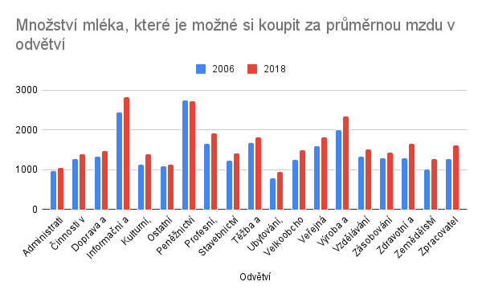

# ENGETO SQL PROJECT
# Struktura projektu

## Soubory s tabulkami:
- primary_table.sql
- secondary_table.sql

## Soubory s odpověďmi:
- answer_1.sql
- answer_2.sql
- answer_3.sql
- answer_4.sql
- answer_5.sql

Nejdřve jsem si vytvořila tabulky primary_table a secondary_table

# Zadání
Na vašem analytickém oddělení nezávislé společnosti, která se zabývá životní úrovní občanů, jste se dohodli, že se pokusíte odpovědět na pár definovaných výzkumných otázek, které adresují dostupnost základních potravin široké veřejnosti. Kolegové již vydefinovali základní otázky, na které se pokusí odpovědět a poskytnout tuto informaci tiskovému oddělení. Toto oddělení bude výsledky prezentovat na následující konferenci zaměřené na tuto oblast.

Potřebují k tomu od vás připravit robustní datové podklady, ve kterých bude možné vidět porovnání dostupnosti potravin na základě průměrných příjmů za určité časové období.

Jako dodatečný materiál připravte i tabulku s HDP, GINI koeficientem a populací dalších evropských států ve stejném období, jako primární přehled pro ČR.

Datové sady, které je možné použít pro získání vhodného datového podkladu:

### Primární tabulky:
- czechia_payroll – Informace o mzdách v různých odvětvích za několikaleté období. 
Datová sada pochází z Portálu otevřených dat ČR.
- czechia_payroll_calculation – Číselník kalkulací v tabulce mezd.
- czechia_payroll_industry_branch – Číselník odvětví v tabulce mezd.
- czechia_payroll_unit – Číselník jednotek hodnot v tabulce mezd.
- czechia_payroll_value_type – Číselník typů hodnot v tabulce mezd.
- czechia_price – Informace o cenách vybraných potravin za několikaleté období. 
Datová sada pochází z Portálu otevřených dat ČR.
- czechia_price_category – Číselník kategorií potravin, které se vyskytují v našem přehledu.

### Číselníky sdílených informací o ČR:
- czechia_region – Číselník krajů České republiky dle normy CZ-NUTS 2.
- czechia_district – Číselník okresů České republiky dle normy LAU.

### Dodatečné tabulky:
- countries - Všemožné informace o zemích na světě, například hlavní město, měna, národní jídlo nebo průměrná výška populace.
- economies - HDP, GINI, daňová zátěž, atd. pro daný stát a rok.

### Výstup projektu
Pomozte kolegům s daným úkolem. Výstupem by měly být dvě tabulky v databázi, ze kterých se požadovaná data dají získat. 
Tabulky pojmenujte t_{jmeno}_{prijmeni}_project_SQL_primary_final (pro data mezd a cen potravin za Českou republiku sjednocených na totožné porovnatelné období – společné roky) 
a t_{jmeno}_{prijmeni}_project_SQL_secondary_final (pro dodatečná data o dalších evropských státech).

Dále připravte sadu SQL, které z vámi připravených tabulek získají datový podklad k odpovězení na vytyčené výzkumné otázky. Pozor, otázky/hypotézy mohou vaše výstupy podporovat i vyvracet! Záleží na tom, co říkají data.

Na svém GitHub účtu vytvořte repozitář (může být soukromý), kam uložíte všechny informace k projektu – hlavně SQL skript generující výslednou tabulku, popis mezivýsledků (průvodní listinu) a informace o výstupních datech (například kde chybí hodnoty apod.).

# Informace z vypracování projektu
Během přípravy primární tabulky jsem narazila na problém, jak by se daly propojit tabulky czechia_payroll s czechia_price. V úvahu připadal sloupec datum, jenže v obou těchto tabulkách bylo datum jinak zadáno, proto jsem všechny ceny v czechia_price zprůměrovala za rok a za jednotlivé kategorie, na hodnoty v czechia_payroll jsem následně také použila výpočet průměru za rok a průmyslové odvětví.

# Primární tabulka
U primary_table jsem kódové označení převedla na textové, vybrala sloupce, které budu dále potřebovat, zprůměrovala stávající hodnoty na roční a propojila tabulku czechia_price s tabulkou czechia_payroll.

# Sekundární tabulka
Tabulku economies jsem propojila s tabulkou country, vybrala potřebné sloupce a provedla jsem výběr pouze na evropské státy a časový úsek stejný jako u primární tabulky.

# Výzkumné otázky
## Otázka č.1
Rostou v průběhu let mzdy ve všech odvětvích, nebo v některých klesají?

## Odpověď č.1
Většinou mzdy rostou, avšak rok 2013 zaznamenal pokles mezd ve většině odvětví, největší pokles nastal v peněžnictví a pojišťovnictví, kdy se jednalo o pokles 4 479 Kč. Odvětví těžba a dobývání zažívá nejvíce poklesů za sledované období a to v roce 2009, kdy mzda klesla o 1 094 Kč, v roce 2013 o 928 Kč, v roce 2014 o 250 Kč a v roce 2016 o 187 Kč.
Mzdy jsem zaokrouhlila matematicky na koruny.

## Otázka č.2
Kolik je možné si koupit litrů mléka a kilogramů chleba za první a poslední srovnatelné období v dostupných datech cen a mezd?

## Odpověď č.2

## Otázka č.3
Která kategorie potravin zdražuje nejpomaleji (je u ní nejnižší percentuální meziroční nárůst)?

## Odpověď č.3

## Otázka č.4
Existuje rok, ve kterém byl meziroční nárůst cen potravin výrazně vyšší než růst mezd (větší než 10 %)?

## Odpověď č.4

## Otázka č.5
Má výška HDP vliv na změny ve mzdách a cenách potravin? Neboli, pokud HDP vzroste výrazněji v jednom roce, projeví se to na cenách potravin či mzdách ve stejném nebo násdujícím roce výraznějším růstem?

## Odpověď č.5

